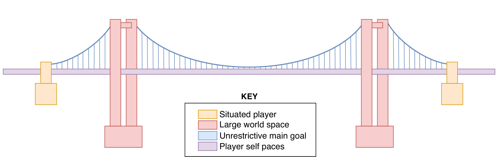

‘It’s an open world game.’

It’s a great phrase isn’t it? Intuitively, most players will know what you mean. But the more you stare at it, the less it makes sense. What does ‘open’ mean? All games at their core are coded to a fixed number of options. So in a sense, all games are ‘closed’. And what about ‘world’, that’s vague too. Some games don’t even take place on a world! But the term clearly has a meaning, or we wouldn’t keep using it.

This was the motivation behind my latest paper on the experience of players in open world games. It’s hard to assess experiences when you don’t even know what an open world ‘is’. And I’m not the first to point out the term is fuzzy at best. There are frequent debates amongst players on forums, in comments section of newspaper articles, even in academic circles you see differing definitions.

So how do you solve this problem? For me, there was two options. Either ask the game designers what they do when creating such games, or ask the players what they think about the term. I opted for the latter – whilst designers obviously have a vision in mind when building these games, it is the players who interpret the game and make it their own. Players experience the game, and by extension perceive it in their own unique way. And we know there isn’t always total agreement between designers and players – just look at the comments left when God of War came out. A designer’s intention is not always followed. 
 

## Defining ‘Open World’: An Interview Study

 

Last year, I asked players of open world games to talk to me about their experiences. This took the forms of interviews, and a subsequent thematic analysis. The process was really rewarding, and I loved how willing players were to talk about their experiences. One of the biggest highlights was asking them my favourite trick question: what’s a closed world? Simple yet disarming in a lot of ways, because it forces you to think in reverse. By talking about what makes a game closed, you learn what players value about games that are open. After a lot of blood, sweat and tears the resulting paper was published a few weeks ago, meaning I can now share with the world what I found.

In summary, I found there to be 5 themes that interlock together to explain what the open world experience is, and how it’s enabled. In this post, I’ll go through each in turn and explain what they mean, with examples of where you can see them in games. I found it helpful to use the example of a suspension bridge to illustrate how the themes work together; sadly my reviewers did not agree. Unfortunately for them, this is my blog so I can use it all I like (#viva la bridge!). Here it is in all its glory:

 

We’ll start with the **first theme**, represented as the orange ‘anchors’ of the bridge – *the player is situated to scale within the world*. Generally speaking, this theme states an open world must allow the player to exist and move around the world as if they were a part of it. This allows the exclusion of building games such as Cities:Skylines where the player is an overseer of sorts, manipulating the world but not being within it. This theme is the bridge anchors as it is the first step; the first checklist box to tick before looking further at a gaming experience.

 

The **second theme** is the pink bridge ‘towers’ – *the world space is large, accessible, and connected*. This is arguably what players are most likely to mention first, hence its representation as the main structural support of the bridge. Players expect an open world to have a large space to move around in, and they expect these areas to be accessible. There are a number of caveats to be found here – first, ‘large’ is a subjective term. There is no fixed size that is ‘too small’, but smaller spaces feel cramped and too restrictive. Secondly, the accessibility of gaming areas is also fuzzy. It is common for open world games to section off areas that can only be accessed after certain plot points (or by setting areas with certain difficulties), because this can help guide players through the intended play route.

The key is that players have the ability to choose the order in which they travel to these new areas. Contrast the Witcher 3 to Spyro: Reignited. Both have map areas that are unlocked through story progression, but the Witcher 3 allows the players to move between them in any order. In contrast, Spyro forces the player to move effectively sequentially through the worlds, in a more typical level progression style. Arguably, a player travelling to a level significantly higher than their current level in the Witcher 3 would encounter resistance to their choice, so much so they may be heavily guided in their movement. But it is the ability to make that choice that makes it an open world, which is not available in the hubworld design of Spyro.

 

The **third theme** is represented by the blue ‘cables’ – *the main goal does not restrict players from engaging with other activities*. This is another commonly mentioned point from players, as this is where the term ‘non-linear’ comes into play. Open world games effectively allow players to ignore the main goal of the game to do other things, usually seen by ignoring the main questline. Whilst having the main goal is important (or else, what other reason is there to start the game in the first place?), players want to engage with it on their own terms. This includes the game having other things for a player TO engage with – any player could stand still in a strongly linear narrative game, but that doesn’t mean they’re playing.

This lack of restriction on what content has to be engaged with is important to players, and helps explain why games such as Skyrim and Detroit: Become Human are different. Both have elaborated narratives to follow, but there is not much else to do in the world of D:BH outside of it. Skyrim forces the player to follow the story at the beginning but quickly opens up new options. The world is full of other content that is arguably more interesting to engage with, and the main story hangs around until you’re ready for it.

Interestingly, this may be why Red Dead Redemption 2 has received some criticism. When players engage with main story features, the rest of the world essentially becomes locked off until the game says so. This is not typical of open world games, which are more likely to give the quest (maybe via a cutscene) and then pass the decision back to the player on whether they want to continue with it. Players who especially value this theme of non-restriction are more likely to be annoyed by this design, whilst those who don’t may be more forgiving.

 

The **fourth theme** here is represented in the purple ‘deck’ - *players can self-pace gameplay through engaging/disengaging with tasks at will*. For me, this is the crux of the experience, and relates to when players say, “do what I want when I want.” This theme is also only possible if the other themes exist, because to be able to ‘do what you want’ the game has to allow you to a) exist within it, b) travel across the world freely, and c) be freed of obligations to a main goal. For these reasons, this theme is the road of the bridge, allowing players to safely travel across the experience.

Players highly value the control they feel over their gameplay in open worlds. Almost anything is within their control. Main story too boring? No problem, go find a new side quest. New area too difficult? Who cares, travel to an older one. Too much going on? So what, sit on a bench and admire the scenery for a few moments. Unlike other games, players don’t need to leave open world games to modulate their experiences. There is enough variety freely available for them to choose activities within the game to keep busy with. 

This also enables the very popular activity of exploring – players love having a world full of shiny things to run towards. Exploring is entirely a self-paced activity, as the player decides when they want to focus on a specific thing they find. Until that point, they are free to run around with no other reason than because they can.

 

The **fifth theme** is not represented in the bridge, because it wasn’t found to be essential to the experience like the others. I do however think it is still worthy of talking about, as it related to enjoyment – *content density is more important than world size*. There may be a perception that bigger is better for open world games, but some of you may get the feeling that if this isn’t done well, the experience suffers. Sometimes, it feels like bigger games aren’t actually that bigger, the points of interest are just stretched further distances apart. There may be more quests to do, but these might be ‘filler,’ collecting items for the sake of an achievement maybe. In these cases, maybe the world would have been better off smaller, but richer? This was a comment left by quite a few players, and highlights that there is a limit to how big a world should be without taking into account other gameplay aspects. If this theme was represented on the bridge, I would say it would be the decorations that beatify it, but are not functional. It’s possible to have a large, empty open world, but it wouldn’t be a good one.

 

If you combine these themes, this is the definition I propose for open world games:

> ***“Players are situated to scale within a large, interconnected, and accessible world, where the main goal does not restrict them from engaging with other activities, allowing players to self-pace gameplay through engaging/disengaging with tasks at will.”***

It’s a bit of a mouthful, but no one said open worlds were simple!

 

So, you can see how the bridge helps demonstrate how the themes relate together. But the final comparison comes from how suspension bridges work from a physics sense. The only reason the bridge stays up is that there are opposing forces kept within tension. This is true of the themes of an open world; players want a large space to explore in and a main goal that allows them to leave it at any point. But they also don’t want to feel like the world is empty and the main goal lacking in meaning. Too much or too little of any of these themes would risk destabilising the experience, and making the bridge collapse. This is why there are no hard lines in this definition, because there is some movement allowed for themes to be slightly out of balance, so long as this isn’t too extreme. Think of the Red Dead 2 example from earlier – players will value some themes over others, and be forgiving for some but maybe not all. The experience of playing a game is still a subjective one, so there will always be some disagreements. 
 

## Other Musings

 

During this work, I had a couple of other insights about open worlds. Firstly, I refer specifically to the open world experience, as the nature of the themes identified means that an open world is something that is enabled. By this I mean that it would probably be incorrect to call open worlds a genre, like FPS or match-3, because the open world experience is something that is enabled through a combination of themes, but on the flipside could also be disabled at any point. Take for instance any tutorial level of an open world game – during that phase of the game, the player is heavily restricted on what they can do, and they have to follow the main goal. At this point, the game is arguably not an open world. However, once released from the tutorial the experience is suddenly enabled due to the increase in freedom. This means ‘open world’ is not really a game type but more of an element that a game may possess. And I don’t think there has to be a limit on when the experience is enabled in the course of a game. Consider any Pokémon game; once you’ve beaten the main goal, you no longer have any restrictions on where to go or what to do. You can run around and catch Pokémon all day. Arguably then, post-story Pokémon is an open world? 

 

A second musing I had is how survival games fit into this equation. They certainly allow a lot of freedom, and some have quite large worlds to explore (like Don’t Starve for example). However, I am hesitant to call them open worlds, due to how I (in all my biased player glory) respond to the restriction of freedom. In survival games the main goal is to, unsurprisingly, survive. This presents a pressing need on what the player must do in order to keep playing. I would argue this can be overly restrictive, and so is not a ‘typical’ open world at least. There will be players who disagree here, perhaps because the restriction is not perceived as so important. To reconcile this I tend to think of survival games as ‘open world adjacent’ – there can certainly be similarities, but there is something unique about them. Don’t Starve does not feel as though it fits in the same category as Fallout 4 for example. Maybe it’s easier to think there is a subset of survival games that have open world elements. 
 

## Conclusion

 

So, open worlds sure are a complicated subject. From my research work I argue that open world games are the following: games where players are situated to scale within a large, interconnected, and accessible world, where the main goal does not restrict them from engaging with other activities, allowing players to self-pace gameplay through engaging/disengaging with tasks at will. I’m sure arguments will still rage on about which games are or are not in this category, as there will always be exceptions to a rule. I hope however this work provides insight to the debate, and can offer examples and explanations of what might be going on. After all, it sure is fun to *open the world* of gaming experiences. 

 

If you want to read the published article, it can be found [here!](https://www.sciencedirect.com/science/article/pii/S1875952120301099?via%3Dihub)
